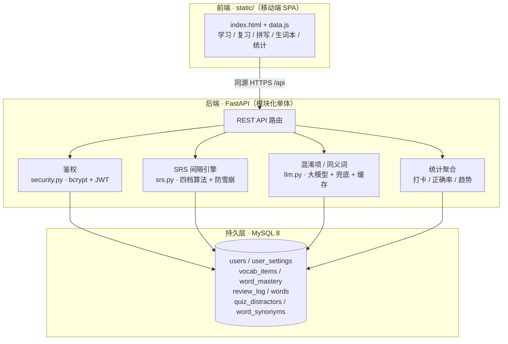

# VocabBuddy · 英语单词间隔复习应用

> 一款面向备考（四六级 / 考研 / 托福 / SAT）的英语单词学习应用，采用 **间隔重复（SRS）+ 百词斩式学习 / 选择题复习** 模式。

核心亮点：**可独立测试的 SRS 复习引擎**、**大模型生成的易混淆干扰项与同义词（无 Key 自动降级、带缓存）**、以及 **「防雪崩」限流机制**（复习积压过多时自动暂停新词、优先清空积压）。

---

## ✨ 功能特性

- **多词库**：CET-4 / CET-6 / 考研 / SAT / 托福，按库随机抽题
- **学习模式**：单词卡片（音标 / 词性 / 释义 / 例句 + 发音），三档自评（不会 / 模糊 / 已掌握）
- **复习模式**：SRS 间隔调度 + 选择题，干扰项由大模型生成（带缓存与本地兜底）
- **拼写练习**、**生词本**（侧滑删除 / 标记掌握）、**学习统计**（正确率 / 连续打卡 / 热力图）
- **同义词扩展**（大模型生成并缓存，辅助联想记忆）
- **防雪崩限流**、深色模式、美 / 英发音切换
- **账号系统**：注册 / 登录（bcrypt + JWT），个人设置持久化

---

## 🏗️ 系统架构



**设计取舍**：选用「模块化单体」而非微服务——单人开发、领域边界清晰、部署简单；代价是进程内耦合，若未来词库服务 / 学习服务需独立伸缩再横向拆分。SRS 引擎 `srs.py` 刻意做成**纯函数、可单测**，便于后续演进到 FSRS 等更优调度算法。

---

## 🧩 技术选型与权衡

| 选型 | 为什么 | 代价 / 取舍 |
|------|--------|-------------|
| **模块化单体（非微服务）** | 边界清晰、部署简单、单人可维护 | 进程内耦合，独立伸缩需再拆 |
| **FastAPI + Uvicorn** | 异步、自动 OpenAPI 文档、类型校验，开发效率高 | ASGI 部署心智成本略高（已由 `deploy/` 解决） |
| **MySQL 8 + SQLAlchemy** | 关系明确、事务可靠；`utf8mb4_bin` 解决重音词唯一键冲突 | 需自备数据库（本地或容器） |
| **SRS 引擎纯函数化** | 可单测、易演进到 FSRS | 当前为固定倍率简化模型，非完整 SM-2/FSRS |
| **大模型仅用标准库 `urllib` 接入** | **零额外依赖**，且全程降级（无 Key / 失败 → 本地兜底） | 可用性 > 智能性，从不因 LLM 故障阻塞学习 |
| **同源托管前端** | 省去跨域与独立部署 | 生产应只托管 `static/` 并前置反代（`deploy/` 已备） |

---

## 📁 目录结构

```
vocabbuddy/
├── backend/                  # FastAPI 后端（模块化单体）
│   ├── app.py                # 应用入口：路由、lifespan 自动建表、同源静态托管
│   ├── config.py             # 环境变量配置（DB / JWT / LLM / 防雪崩）
│   ├── models.py             # SQLAlchemy ORM 模型（7 张表）
│   ├── schemas.py            # Pydantic 请求 / 响应契约
│   ├── srs.py                # SRS 间隔复习引擎（纯函数，可单测）
│   ├── security.py           # bcrypt 哈希 + JWT 签发 / 校验
│   ├── llm.py                # 大模型混淆项 / 同义词生成（仅标准库 + 降级）
│   ├── db.py                 # 引擎 / 会话 / 依赖注入
│   ├── import_words.py       # 词库导入（GitHub 词库源）
│   ├── init_db.py            # 建表脚本
│   └── .env.example          # 后端环境变量模板
├── static/                   # 前端 SPA（移动端模拟，内联 CSS/JS）
│   ├── index.html            # 单页应用（含登录、学习、复习、统计等页面）
│   └── data.js               # 应用元数据 + 词库选项 + 静态兜底词
├── deploy/                   # 云部署产物
│   ├── Dockerfile            # 应用镜像
│   ├── docker-compose.yml    # 应用 + MySQL 8
│   ├── nginx.conf            # HTTPS 反代
│   ├── vocabbuddy.service    # systemd 单元
│   └── .env.server.example   # 服务端环境变量模板
├── deliverables/             # PRD / 设计文档等交付物
├── DEPLOYMENT.md             # 部署手册
├── VocabBuddy_MVP_PRD.md     # 产品需求文档
└── .env.example              # 根环境变量模板（真实 .env 已被忽略）
```

---

## 🚀 本地运行

### 前置条件
- Python 3.13+
- MySQL 8.0（本地或容器，字符集 `utf8mb4`）

### 步骤

```bash
# 1. 准备数据库（MySQL 8）
mysql -u root -p
CREATE DATABASE vocabbuddy CHARACTER SET utf8mb4 COLLATE utf8mb4_bin;
CREATE USER 'vocabbuddy'@'localhost' IDENTIFIED BY 'vocabbuddy';
GRANT ALL PRIVILEGES ON vocabbuddy.* TO 'vocabbuddy'@'localhost';
FLUSH PRIVILEGES;

# 2. 配置环境变量
cp .env.example .env          # 按需修改 DB 串与 JWT 密钥

# 3. 安装依赖（建议使用虚拟环境）
python -m venv .venv
source .venv/bin/activate      # Windows: .venv\Scripts\activate
pip install -r backend/requirements.txt

# 4. 导入词库（首次运行；需联网拉取 GitHub 词库源）
python -m backend.import_words

# 5. 启动后端（自动建表并同源托管前端）
python -m uvicorn backend.app:app --host 127.0.0.1 --port 8000

# 6. 浏览器打开
#    http://127.0.0.1:8000
```

> ⚠️ **前端强依赖后端**：本应用为「前端 SPA + FastAPI 后端」架构，登录、设置、统计、生词本、单词均通过同源 `/api/*` 获取。未启动后端时，页面只会停在登录界面并提示「请确认后端已启动」。`data.js` 内置少量静态兜底词，但完整功能必须配合后端运行。
>
> 想零成本对外展示？`deploy/` 目录已含 Docker + nginx 配置，可一键上云（详见 `DEPLOYMENT.md`）。

---

## 📡 API 概览

| 方法 | 路径 | 说明 | 鉴权 |
|------|------|------|------|
| GET | `/health` | 健康检查 | 公开 |
| POST | `/api/auth/register` | 注册 | 公开 |
| POST | `/api/auth/login` | 登录 | 公开 |
| GET/PUT | `/api/settings` | 获取 / 更新设置 | 登录 |
| GET/POST/DELETE | `/api/vocab` | 生词本列表 / 加入 / 移除 | 登录 |
| POST | `/api/vocab/{en}/master` | 标记已掌握 | 登录 |
| POST | `/api/learn` | 新词首曝光学（驱动 SRS 首间隔） | 登录 |
| POST | `/api/review` | 复习评分（SRS 核心） | 登录 |
| GET | `/api/review/queue` | 到期复习队列（防雪崩封顶） | 登录 |
| GET | `/api/libraries` | 可用词库及单词数 | 登录 |
| GET | `/api/words` | 按词库取词（`random=1` 随机抽题） | 登录 |
| POST | `/api/quiz/distractors` | 单题混淆项（大模型 + 兜底） | 登录 |
| POST | `/api/quiz/distractors/batch` | 批量混淆项（复习预拉取） | 登录 |
| POST | `/api/words/synonyms` | 同义词（大模型 + 缓存） | 登录 |
| GET | `/api/stats/home` · `/api/stats` | 首页 / 学习统计 | 登录 |

> 开发环境自动开放 `/docs` 交互式文档；生产环境 `VOCABBUDDY_ENV=production` 下自动关闭。

---

## 🔐 安全说明

- **密钥不入库**：`.env` / `.env.*` 已被 `.gitignore` 忽略，仓库仅保留 `.env.example` 模板。
- **JWT 密钥与大模型 API Key 绝不上库**，生产通过环境变量注入。
- **静态托管只挂载 `static/`**，绝不挂载项目根目录，避免 `.env` / 源码被公开下载。
- 生产环境自动关闭 `/docs`、`/redoc`、`/openapi.json`。

---

## 🗺️ 部署

`deploy/` 提供生产就绪产物：`Dockerfile`、`docker-compose.yml`（应用 + MySQL 8）、`nginx.conf`（HTTPS 反代）、`vocabbuddy.service`（systemd）。完整步骤见 [`DEPLOYMENT.md`](./DEPLOYMENT.md)。

---

## 📄 License

本仓库暂未指定开源协议；如需商用或二次分发，请联系作者。
